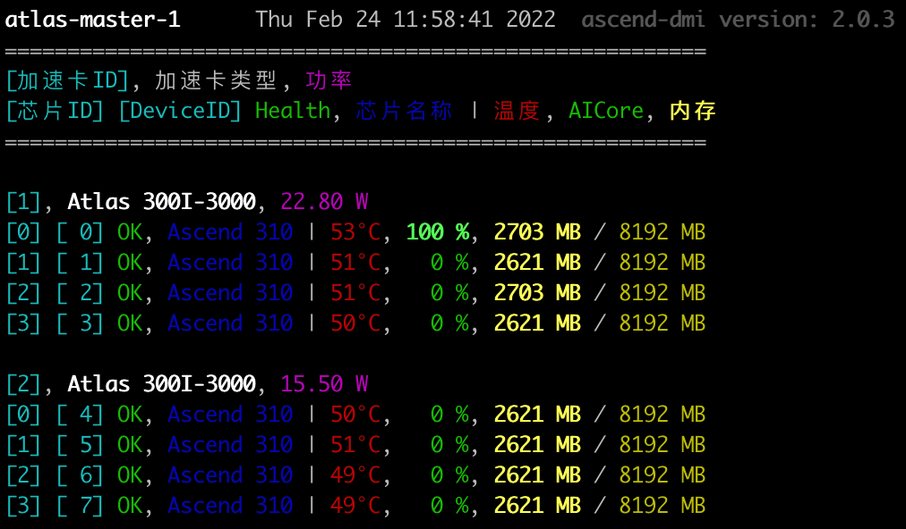

# `npustat`

一个能够简洁的显示华为atlas设备状态的命令行工具；

之前使用GPU时习惯了使用工具 [`gpustat`](https://github.com/wookayin/gpustat) 查看GPU状态，使用华为的Atlas设备之后发现并没有类似的工具，于是仿照  [`gpustat`](https://github.com/wookayin/gpustat) 自己写了一个；
显示效果如下图：

 

主要解决命令 `npu-smi info` 的两个缺点：

* 显示的信息总是特别长，笔记本单屏显示不下；
* `watch` 下，同一芯片每次展示不在屏幕的同一位置，观察该芯片的变化较困难；

## 依赖说明

python版本要求：`python>=3.6`；

基础软件方面依赖说明：

华为Atlas设备目前有两种方式可以获取加速卡的状态信息：`ascend-dmi -i` 和 `npu-smi info`，这两者的区别为：

* 命令 `ascend-dmi -i`：
    * 优点：
        * 查询结果为json格式，易于解析，不会出错；
        * 查询结果中包含实时功率信息；
    * 缺点：
        * 速度较慢，每次查询耗时约2～3秒；
        * 需要安装了 `toolbox` 工具包并正确配置了环境变量；
* 命令 `npu-smi info`：
    * 优点：
        * 查询速度快，每次查询小于1秒；
        * 只要正确安装了驱动即可，不需要额外安装其他包；
    * 缺点：
        * 查询结果中不包含实时功率信息；
        * 查询结果无法以json格式返回，解析容易出错，遇到错误时欢迎反馈； 

默认使用命令 `ascend-dmi -i` 做查询，可以使用参数 `--use-npu-smi` 修改为使用命令 `npu-smi info` 做查询；

目前仅在配备了4张 `Atlas 300I-3000` 推理卡的 Atlas 500 服务器上进行过测试；所以在其他设备上难免会有问题，欢迎反馈问题；有任何优化建议也欢迎反馈；

> 注：若要安装 `toolbox` 需要注意，华为的 `toolbox` 工具包相关的版本体系出现过多次变迁：
> 
> * 在`CANN`的`v5.0.1`及以前版本，`toolbox` 工具包归属到`CANN`中，可在`CANN`的软件下载链接中进行下载；
> * 在`CANN`的`v5.0.2`及以后的版本中不再包含`toolbox` 工具包，而是迁移到了`mindx`中，需要到`mindx`的软件下载链接中进行下载；

## 安装说明


## 使用说明

使用如下命令单次获取当前atlas设备信息：

```shell
npustat
```

使用如下命令动态刷新当前atlas设备信息，默认每2秒刷新一次：

```
npustat --watch
```

可选参数如下：

```
usage: cli.py [-h] [--json] [-i [INTERVAL]] [--no-header] [--no-title]
              [--use-npu-smi] [--show-power] [--compact] [--debug] [-v]

optional arguments:
  -h, --help            show this help message and exit
  
  --json                将所有结果输出为JSON格式；
  
  -i [INTERVAL], --interval [INTERVAL], --watch [INTERVAL]
                        动态刷新模式；INTERVAL为刷新间隔，单位：秒；默认每2秒刷新一次；
  
  --no-header           是否隐藏 header 信息；header 信息包含机器名称、当前时间、版本号；默认展示 header 信息，配置该参数后 header 信息不再展示；
  
  --no-title            是否隐藏 title 信息；title 信息为对当前设备状态值各字段的说明；默认展示 title 信息，配置该参数后 title 信息不再展示；
  
  --use-npu-smi         使用命令"npu-smi info"获取当前设备状态值；注意该命令无法获取到加速卡的实时功率信息；
  
  --show-power          是否展示加速卡的功率信息，默认为展示；配置了参数 "--use-npu-smi" 之后该参数无效；
  
  --compact             是否采用紧凑模式展示信息，默认为不采用；紧凑模式下会去掉空白行及其他无意义的行，适用于加速卡较多，显示器较小，屏幕显示不下的情况；
  
  --debug               Debug模式时允许在程序出错的情况下打印更多的调试信息；
  
  -v, --version         show program's version number and exit
```

#### 另外：

比较遗憾的是，目前我没有在任何华为的官方文档中找到获取每个设备上运行了哪些进程的功能，在昇腾论坛的询问结果也是如此：[【Atlas 300I 推理卡】怎样查看有哪些进程正在上面运行？
](https://bbs.huaweicloud.com/forum/thread-173510-1-1.html)

所以本项目也不具有显示每个设备上运行了哪些进程的功能；如有人知道如何获取每个atlas上运行了哪些进程，还请告知；

## 显示内容说明

```
machine_name  Mon Dec 20 22:38:59 2021  ascend-dmi version: 2.0.3
========================================================
[加速卡ID], 加速卡类型, 功率
[芯片ID] [DeviceID] Health, 芯片名称 | 温度, AICore, 内存
========================================================

[1], Atlas 300I-3000, 16.30 W
[0] [1] OK, Ascend 310 | 51°C,   0 %, 2621 MB / 8192 MB
```

* header：第1行为header，可以使用参数 `--no-header` 不展示该信息；展示的信息从左到右依次为机器名称、当前时间、软件 `ascend-dmi/npu-smi` 的版本；

* title：第2~5行为title，可以使用参数 `--no-title` 不展示该信息；title是对后面展示的信息的各字段的说明；

*  `[1], Atlas 300I-3000, 16.30 W`：每个加速卡的信息：
    * `[1]`：加速卡ID；
    * `Atlas 300I-3000`：加速卡类型；
    * `16.30 W`： 加速卡实时功率；

*  `[0] [1] OK, Ascend 310 | 51°C,   0 %, 2621 MB / 8192 MB`：每个芯片的信息：
    * `[0]`：芯片ID；
    * `[1]`：DeviceID；
    * `OK`：芯片健康状态；
    * `Ascend 310`：芯片名称；
    * `51°C`：温度；
    * `0 %`：AICore；
    * `2621 MB / 8192 MB`：内存；

## Reference

本项目的灵感、排版展示、以及代码的整体结构都是源自 [`gpustat`](https://github.com/wookayin/gpustat)，本项目只是将其工作适配到了华为Atlas设备上；

## License

[MIT License](./LICENSE)
